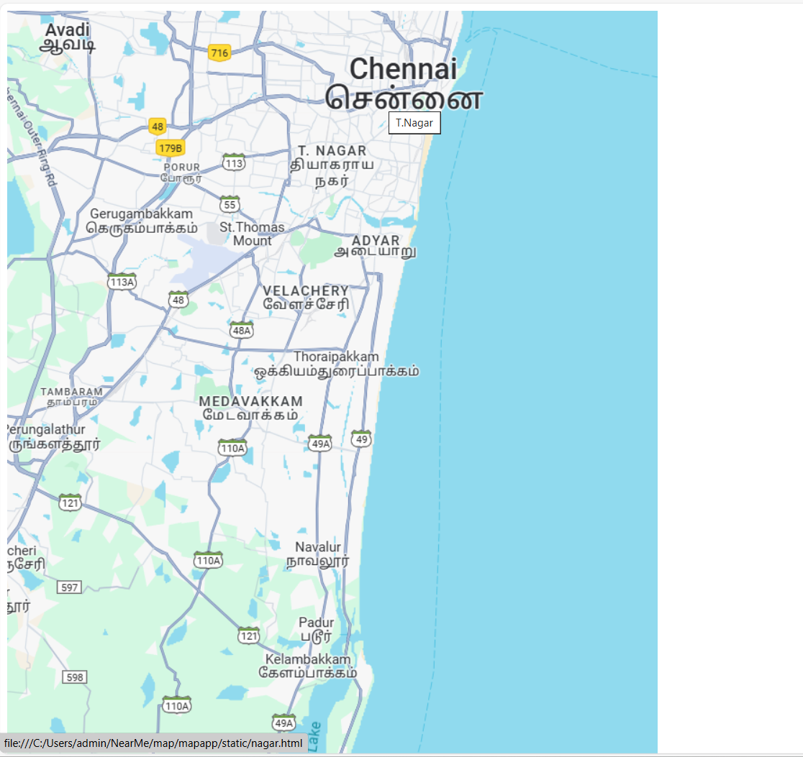
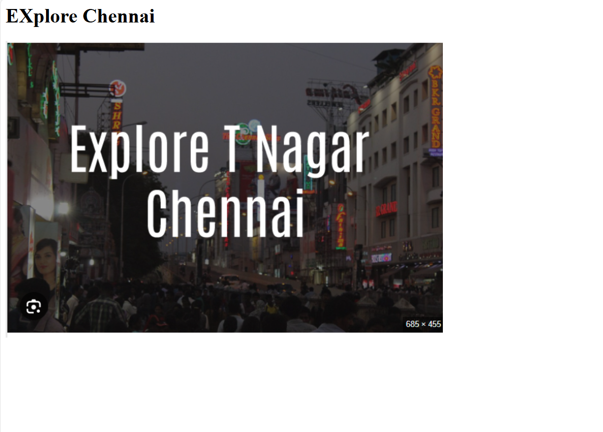
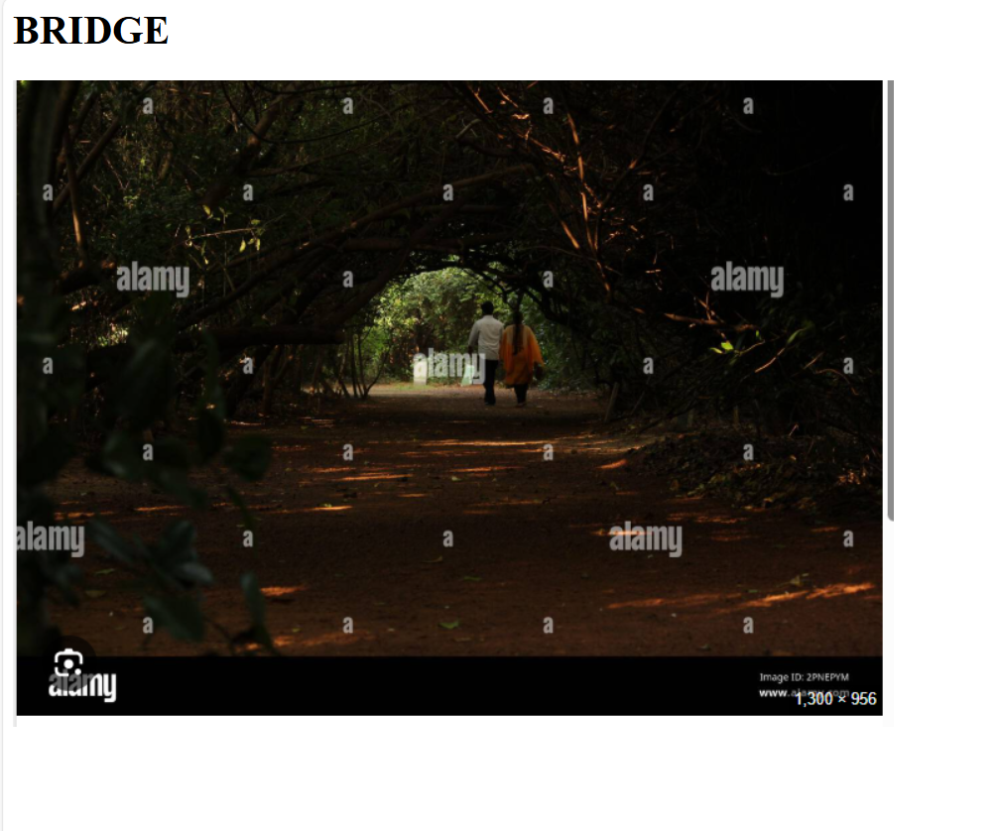

# Ex04 Places Around Me
## Date: 30-04-25

## AIM
To develop a website to display details about the places around my house.

## DESIGN STEPS

### STEP 1
Create a Django admin interface.

### STEP 2
Download your city map from Google.

### STEP 3
Using ```<map>``` tag name the map.

### STEP 4
Create clickable regions in the image using ```<area>``` tag.

### STEP 5
Write HTML programs for all the regions identified.

### STEP 6
Execute the programs and publish them.

## CODE
 ## home.html

 ```
 <!-- Image Map Generated by http://www.image-map.net/ -->cd 


<map name="image-map">
    <area target="" alt="T.Nagar" title="T.Nagar" href="nagar.html" coords="316,211,509,33" shape="rect">
    <area target="" alt="Adyar" title="Adyar" href="land.html" coords="453,98,451,312,339,277" shape="poly">
    <area target="" alt="Velachery" title="Velachery" href="river.html" coords="321,306,114" shape="circle">
</map>
```

## T.nagar
```
<html>
    <title>T>NAGRA</title>
    <h1>EXplore Chennai</h1>
    
</html>
```

## Adyar
```
 <html>
    <title>ADYAR</title>
    <h1>BRIDGE</h1>
    
</html>
```

## Velachery
```
<html>
    <title>VELACHERY</title>
    <h1>Night View </h1>
    
</html>
```
## OUTPUT

  ## home 
     
  ## T.Nagar
    
  ## Adyar
    
  ## Velachery
        


## RESULT
The program for implementing image maps using HTML is executed successfully.
